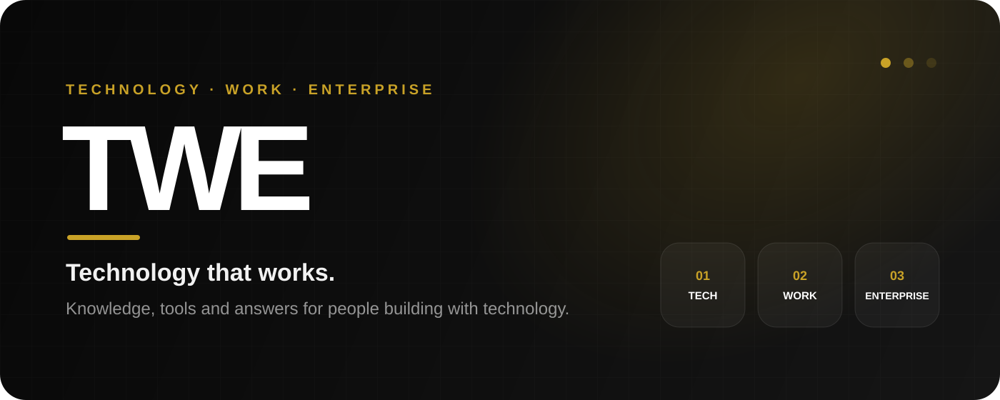
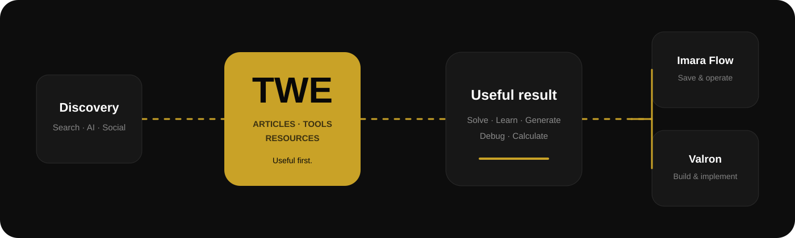
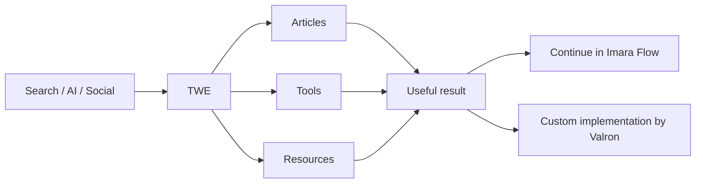

<div align="center">



<br />

<a href="https://twe.co.ke"></a>


<a href="./LICENSE"></a>

### Technology that works.

**Practical knowledge, tools and answers for developers, teams and businesses building with technology.**

[Explore TWE](https://twe.co.ke) · [Architecture](./docs/ARCHITECTURE.md) · [Deployment](./docs/DEPLOYMENT.md) · [Brand](./docs/BRAND.md)

</div>

---

## What is TWE?

TWE stands for **Technology. Work. Enterprise.** It is a practical technology workspace built around real problems rather than generic content.

| Pillar | What it covers |
| --- | --- |
| **Technology** | Development, debugging, APIs, infrastructure, databases, AI and security |
| **Work** | Practical tools, automation, workflows, productivity and technical problem-solving |
| **Enterprise** | Business systems, software operations, digital transformation and commercial technology |

TWE is designed to be **useful before it asks for anything**. Technical content earns trust. Useful tools create repeat use. Enterprise content connects real operational problems to implementation.

<br />



---

## Built for problems people actually have

```text
Why is this application failing?
How should this system be architected?
What should a proper inventory system track?
How do I automate this workflow?
Can I generate this document without buying another tool?
When has a spreadsheet stopped being enough?
```

### Articles
Search-first editorial and technical content around real errors, implementation decisions and business-system problems.

### Tools
Focused utilities that solve a complete task, including developer diagnostics and business generators/calculators.

### Resources
Reusable implementation guides, references, templates, checklists and technical material.

### Control Centre
The backend operating layer for CMS content, tools, resources, jobs, newsletters, settings, leads and team access.

---

## Product architecture



The boundary is deliberate:

- **TWE** owns discovery, public knowledge, anonymous utilities and conversion context.
- **Imara Flow** should own persistent operational records such as customers, products, invoices, inventory, sales and money records.
- **Valron** handles qualified custom-system, integration and infrastructure work when the problem exceeds a self-serve tool.

See [`docs/ARCHITECTURE.md`](./docs/ARCHITECTURE.md).

---

## Repository principles

1. **Useful before signup.** Public tools should produce a useful result before account creation wherever practical.
2. **One source of truth.** Do not duplicate persistent business records between TWE and Imara Flow.
3. **Search-first public content.** Public pages should be fast, semantic, indexable and structured for search and AI discovery.
4. **Shared-hosting friendly.** Production must remain deployable to cPanel/shared hosting without requiring Composer or npm on the server.
5. **Control Centre managed.** Operational content and access should be manageable from the backend.
6. **Secrets never belong in Git.** Production credentials live in `.env`, never in source control.

---

## Repository map

```text
.
├── .github/
│   ├── ISSUE_TEMPLATE/
│   ├── workflows/
│   ├── CODEOWNERS
│   └── pull_request_template.md
├── assets/
│   └── readme/
├── docs/
│   ├── ARCHITECTURE.md
│   ├── BRAND.md
│   ├── DEPLOYMENT.md
│   └── ROADMAP.md
├── scripts/
├── storage/
│   ├── cache/
│   └── logs/
├── .env.example
├── .gitignore
├── CONTRIBUTING.md
├── SECURITY.md
└── README.md
```

---

## Local configuration

```bash
cp .env.example .env
```

Then add environment-specific values locally or on the server.

> **Never commit `.env`.** The repository intentionally tracks `.env.example` so configuration requirements remain documented without exposing credentials.

---

## Deployment model

```text
main → validation → release package → cPanel → .env → health check
```

The server should not need a Composer or npm build step. If build tooling is introduced, dependencies should be prepared **before** the release package is uploaded.

See [`docs/DEPLOYMENT.md`](./docs/DEPLOYMENT.md).

---

## Visual system

| Token | Value | Role |
| --- | --- | --- |
| TWE Black | `#080808` | Core identity, text, dark surfaces |
| White | `#FFFFFF` | Primary canvas |
| Valron Gold | `#C9A227` | Restrained accent |
| Carbon | `#1C1C1C` | Technical surfaces |
| Graphite | `#505050` | Secondary copy |
| Warm Canvas | `#F7F6F2` | Editorial background |
| Border Grey | `#E7E5E0` | Dividers and borders |

Primary interface typography: **Montserrat**  
Technical typography: **JetBrains Mono**

---

## Security

Do **not** commit `.env`, credentials, private keys, payment secrets, API tokens or production database dumps containing customer data.

If a credential is ever committed, rotate it immediately. Removing it in a later commit does not make the exposed credential safe.

See [`SECURITY.md`](./SECURITY.md).

---

## Development workflow

```text
feature/<name>
fix/<name>
content/<name>
chore/<name>
```

Before merging: verify no secrets are included, run PHP syntax checks, test affected routes, check mobile layouts, verify Control Centre permissions and document database/environment changes.

See [`CONTRIBUTING.md`](./CONTRIBUTING.md).

---

## Roadmap

The near-term direction is tracked in [`docs/ROADMAP.md`](./docs/ROADMAP.md), covering the public knowledge layer, deeply capable tools, resource library, Control Centre and the TWE → Imara Flow → Valron handoff.

---

<div align="center">

### TWE
**Technology. Work. Enterprise.**

**Technology that works.**

A Valron initiative.

[twe.co.ke](https://twe.co.ke) · [valron.tech](https://valron.tech)

</div>
